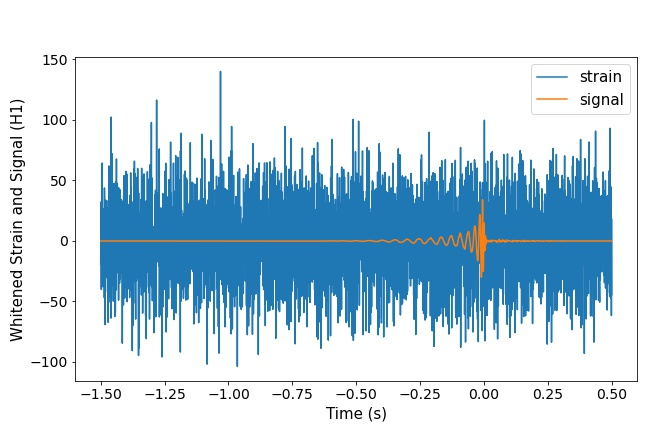

# Generate gravitational-wave data

Codes to generate gravitational-wave data we need for our experiments. We use the open source tool [ggwd](https://github.com/timothygebhard/ggwd) for paper [*Convolutional neural networks: a magic bullet for gravitational-wave detection?*](https://journals.aps.org/prd/abstract/10.1103/PhysRevD.100.063015) [[arXiv:1904.08693](https://arxiv.org/abs/1904.08693)]  to generate our data. **This tool is so wonderful 🤗 that we strongly recommend you to read the original code.**

Compared with the original code, we added a few functions, including:

- signal-only whiten
- whiten signal visualization

## Introduction

**To see details of this tool, please check the original tool documentation: [ggwd documentation](https://github.com/timothygebhard/ggwd#documentation) .**

We added signal-only whiten and whiten signal visualization for data visualization. Detail changes can be found in:

- `utils/samplegeneration.py`: In addition to gravitational-wave whitening, we also whitened the pure signal for visualization.
- `generate_sample.py`: We added `h1_output_signal` and `l1_output_signal` interfaces for users to access those whiten signals.

## Requirements

The environment we used is the same as [ggwd](https://github.com/timothygebhard/ggwd) . Considering that Python 2.7 reached the end of its life on January 1st, 2020, problems may occur for users to set up their own environment. **Thus, we give a pipeline of our own as follows👇:**

1. create virtual env

```
conda create -n gwenv python=2.7
```

2. set the ipykernel

```
$ conda activate gwenv
$ pip install ipython==5.5.0 
$ pip install ipykernel==4.8.2
$ pip install tornado==4.5
```

3. update pip

```
pip install --upgrade pip
```

4. install packages for ggwd

```
pip install -r requirements.txt
```

5. install other packages needed in `whiten_wavepic_draw.ipynb` and `data2csv.ipynb`.

## Usage

For details to use this tool, please check the original documentation: [ggwd documentation](https://github.com/timothygebhard/ggwd#documentation) .

### 1.Set parameter values

When you generate samples or datasets, you should set parameter values in `default.json` and `waveform_params.ini` of your own.

Parameters that you may change in `default.json` :

```
random_seed, waveform_params_file_name, n_injection_samples, n_noise_samples, output_file_name
```

Parameters that you may change in `waveform_params.ini` :

```
mass1, mass2, spin1z, spin2z, ra, dec, coa_phase, inclination, polarization, injection_snr
```

### 2.Generate Samples

Get to the path of this code, run:

```
python generate_sample.py --config-file=default.json
```

The results will be stored in `./output`.

### 3.Constant parameters

If you wanna set parameters such as mass1 to a constant value, you should edit

1. `variable_args` (line 5) and `DISTRIBUTION FOR PARAMETERS` (line 55) in Waveform_params.ini
2. `args` (line 96) that returned in `staticargs.py`

3. `simulation_parameters` in line 194, 260 of `waveforms.py` 
4. `injection_snr` (if you wanna set snr to constant) in line 212 of `samplegeneration.py`
5. Line 316 of `samplefiles.py`

## Example

We offer a example in `./config_files`, which parameters are all set to constant values. You can compare our code with the original setting in [ggwd](https://github.com/timothygebhard/ggwd) .

Run Jupyter Notebook `whiten_wavepic_draw.ipynb`, the result will be saved in `./img` :



## Data2Csv

If you generate a dataset, you can run `data2csv.ipynb` to preprocess your data, including:

- Split training sets and testing sets.
- Add classification labels for data.

## Issues

In the coding process of our code, we found that parameter settings in the original code have some problems. We suggest you to set:

```
f_lower = 10
whitening_segment_duration = 1
whitening_max_filter_duration = 1
```

in `/config_files/your_dataset_name.ini` when you generate your own datasets, as we did in `waveform_params.ini`.

